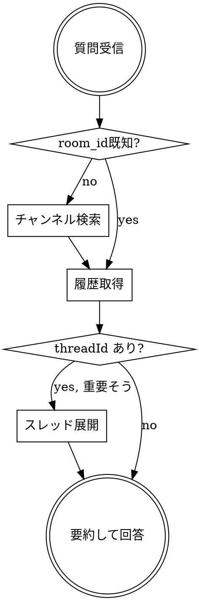

# Rocket Chat 情報収集

社内のRocket Chatから必要な情報を素早く正確に見つけ出すためのリファレンス。
チャンネル特定 → 履歴取得 → スレッド深掘りの3フェーズで情報に到達する。

## 利用可能なツール

| ツール | 用途 | 主要パラメータ |
|--------|------|----------------|
| `mcp__rocketchat__list_channels` | チャンネル一覧取得・検索 | `filter`(名前/表示名で絞込), `count`(max200) |
| `mcp__rocketchat__get_channel_history` | チャンネルの会話履歴取得 | `room_id`, `count`(max200), `oldest`/`latest`(ISO8601) |
| `mcp__rocketchat__get_room_info` | チャンネルの基本情報取得 | `room_id` |
| `mcp__rocketchat__get_thread_messages` | スレッド内の返信取得 | `thread_id`, `count`(max200), `offset` |
| `mcp__rocketchat__search_messages` | キーワードでメッセージ全文検索 | `room_id`, `search_text`, `count` |
| `mcp__rocketchat__get_pinned_messages` | ピン留めメッセージ取得 | `room_id`, `count`, `offset` |

## 情報収集フロー

## 検索パターン

**パターンA: 特定の話題を探す**
1. `list_channels` (filter: 関連キーワード)
2. `get_channel_history` (oldest/latest で期間絞込)
3. `get_thread_messages` (threadId があれば)

**パターンB: 特定の人の発言を探す**
1. `list_channels` (filter: ユーザー名) → DM特定
2. `get_channel_history` → usernameで発言者フィルタ

**パターンC: チャンネルの概要把握**
1. `get_room_info` → トピック・説明・参加人数確認
2. `get_channel_history` (count: 50-100, 直近)

**パターンD: 時系列での経緯調査**
1. `get_channel_history` (oldest: 開始日) → 古い方から時系列取得
2. threadIdのあるメッセージを優先的に展開
3. `latest`をずらしながら追加取得

**パターンE: キーワードで横断検索**
1. `search_messages` (room_id + search_text) → キーワードに一致するメッセージを横断検索
2. 見つかったメッセージに `threadId` があれば `get_thread_messages` で展開

## 行動原則

- **最速到達**: 最小限のツール呼び出しで必要な情報に到達する
- **並列実行**: 独立した複数チャンネルの履歴取得は並列で実行する
- **段階的深掘り**: まず広く浅く探索し、関連性の高い部分を深掘りする
- **要約提示**: 生データの羅列ではなく、質問に直接答える形で要約する

## 注意事項

- room_idが不明な場合は必ず`list_channels`で先に特定する（推測で直接指定しない）
- 日時はISO 8601形式で指定（例: `2024-01-15T00:00:00.000Z`）
- スレッドの返信はチャンネル履歴に含まれない → threadIdがあれば`get_thread_messages`で別途取得
- 1回200件上限 → 大量取得は`oldest`/`latest`をずらして分割取得
- 日本語の表示名（fname）と内部名（name）の両方で検索される

## よくある失敗

| 失敗 | 対処 |
|------|------|
| `room_id` を推測で直接指定してしまう | 必ず `list_channels` で先に特定する |
| スレッド返信を見逃す | `threadId` があるメッセージは `get_thread_messages` で確認 |
| 200件上限で取得漏れ | `oldest`/`latest` で期間を分割して追加取得 |
| キーワード検索を後回しにする | `search_messages` でまず横断検索してから絞り込むと速い |
